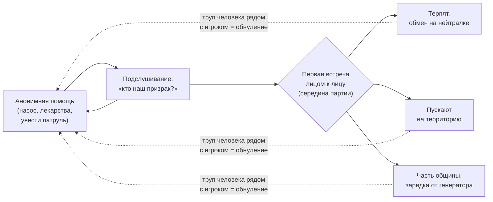

# Люди и петля доверия

## Масштаб

- **Одна группа выживших на партию**: ~10 персонажей с именами, характерами
  и расписаниями. Посильно для соло: своя HFSM + расписания
  (`09-ARCHITECTURE.md`), без глобальной симуляции общества.
- На релиз — 3–4 заготовленных варианта групп (разные составы, локации, нравы)
  для реиграбельности.

## Стартовое состояние

Увидят — стреляют. Игрок для них неотличим от машин роя.

## Петля доверия (ядро эмоциональной линии)

1. **Анонимная фаза.** Игрок помогает, не показываясь:
   - чинит их водокачку/генератор ночью;
   - оставляет дефицитные лекарства и припасы;
   - уводит патруль роя от их убежища.
2. **Обратная связь.** Игрок подслушивает своими сенсорами, как группа спорит,
   кто их «призрак». Награда — нарратив, а не цифры.

3. **Первая встреча лицом к лицу** — срежиссированное событие середины партии.
   Момент, ради которого играют. Исход зависит от накопленного доверия
   и текущей конфигурации тела игрока.
4. **Спектр отношений после встречи:**
   - терпят, меняются ресурсами на нейтральной точке;
   - пускают на территорию;
   - игрок — часть общины, заряжается от их генератора.

## Свойства доверия

- **Медленное и хрупкое.** Один увиденный ими труп человека рядом с игроком —
  обнуление.
- **Несимметричное.** Их страх рационален; игрок должен доказывать, они — нет.
- **Зависит от облика.** Военные модули на корпусе замедляют рост доверия:
  твоя сила пугает тех, кого ты защищаешь (связка с системой билдов —
  см. `04-PROGRESSION-ENDINGS.md`).

## Что дают люди (уникальные ресурсы линии)

- Смазка, расходники, тонкая моторика ремонта (человеческие руки чинят то,
  что робот сам в себе не достанет).
- Безопасная зарядка (их генератор вне сети роя).
- Информация о мире и о ночи Сигнала — их перспектива.
- **Цель.** Линия людей — путь к финалу «Мост» и эмоциональный центр игры.

## Технические заметки (Godot)

- ИИ людей: своя HFSM + суточные расписания; активная симуляция только
  в радиусе игрока, остальное — абстрактные тики (LOD-модель из
  `09-ARCHITECTURE.md`).
- Диалоги: подслушивание — тексты, привязанные к состоянию доверия и последним
  событиям (шаблоны + слоты).
