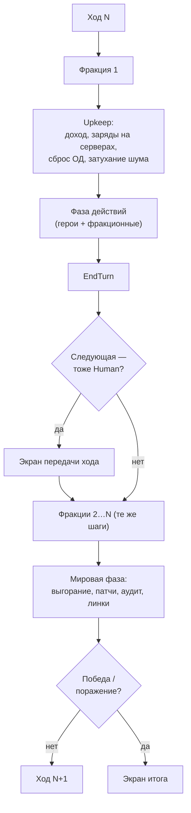

# Структура хода, действия, мировая фаза, победа

> Стартовые числа — в `07-BALANCE.md`.

## 1. Ход

Ход = каждая из N фракций по очереди, затем мировая фаза. Порядок
фракций — список, фиксированный на партию (случайный при создании);
выбывшие пропускаются. Каждый следующий по порядку получает на старте
компенсацию `+LateStartBonus × позиция` Compute (параметр).

**Хотсит.** Если следующая по порядку фракция — `Human` и предыдущая тоже,
между ними показывается **экран передачи хода**: карта скрыта, «Передай
устройство игроку X», кнопка «Готов». Туман у каждой фракции свой, поэтому
скрывать надо весь экран, а не только панели. Бот ходит без экрана.

Upkeep идёт **в начале хода фракции**, а не в конце: игрок сразу видит
доход и пополненные заряды и планирует с полной информацией.

## 2. Действия героя

| Действие | ОД | Цель | Эффект | Шум |
|---|---|---|---|---|
| **Move** | 1/гекс | Соседний **свой** узел (включая линки) | Перемещение | 0 |
| **Exploit** | 1 | Соседний узел | Захват по правилу (`04-EXPLOITS.md §2`), тратит заряд | много |
| **Scan** | 1 | — | Снять туман радиусом 2 (3 с роутера) от героя | мало |
| **Harden** | 2 + Compute | Свой узел под героем | `Hardening + 1` (макс. +3) | средне |
| **Lurk** | 1 | Свой узел под героем | `Noise = 0` | — |

Все действия проверяются одной функцией `Legal(state, action)`; UI и ИИ
получают один и тот же список легальных действий (`06-AI.md`,
`09-ARCHITECTURE.md`).

## 3. Фракционные действия (без героя и ОД, только Compute)

| Действие | Где | Эффект |
|---|---|---|
| **Compile** | Свой сервер | Новый эксплойт в слот героя на сервере / в арсенал сервера |
| **Spawn** | Свой сервер | Новый герой на сервере (в пределах лимита) |
| **Mutate** | — | Купить модификатор генома (с учётом `Requires`) |
| **EndTurn** | — | Передать ход |

## 4. Мировая фаза (люди как погода)

Таблица правил `WorldEvent { Id, When, Apply, Weight }`. Каждое —
условие + эффект над `GameState`, симметричные для всех фракций.

| Событие | Когда | Эффект |
|---|---|---|
| **Burnout** | `Exposure[def] ≥ limit` | `Power − 1` эксплойту для всех, лог «уязвимость закрыта» |
| **Patch wave** | Каждые K ходов, K падает с номером хода | Случайная ОС: `Patch + 1` всем узлам этой ОС (кап 5), включая захваченные |
| **Audit** | Каждый ход | Все узлы с `Noise ≥ 0.8`: владелец → нейтрал, `Hardening → 0`, `Patch + 1`, герой на узле убит |
| **Link outage** | Редко, с хода 15 | Случайный линк отключён на 3 хода |
| **Migration** | Редко | Нейтральный сервер меняет ОС (датацентр «переехал») |

Частота патчей и аудитов растёт с номером хода — «люди просыпаются»:
партия обязана закончиться до того, как сеть станет непробиваемой.

## 5. Победа и поражение (параметры данных)

Всё считается **по командам**: одиночная фракция — команда из одной.

| Условие | Что |
|---|---|
| **Elimination** | Осталась одна команда с героями или серверами — она победила |
| **Domination** | Команда контролирует ≥ `DominationShare[N]` не-пустых узлов **и** все роутеры |
| **Turn limit** | Ход `TurnLimit[N]`: побеждает команда с большим контролем (при равенстве — больше серверов) |

Фракция **выбывает**, когда у неё нет ни героев, ни серверов: её узлы
становятся нейтральными (`Hardening → 0`), ход пропускается, в хотсите
игрок больше не получает экран. Выбывший союзник не мешает команде
победить. Проверка — после мировой фазы; при одновременном выполнении
у нескольких команд — turn-limit-правило между ними.

Пороги по числу фракций — в `07-BALANCE.md §7`; в дуэли: 60 %, ход 60.

## 6. Темп партии (целевой)

- 40–60 ходов, 30–60 минут реального времени.
- Ходы 1–10: расширение по своему кластеру, первый сервер, T1–T2.
- Ходы 10–25: борьба за роутеры, первые контакты, укрепления, шум/аудиты.
- Ходы 25–45: датацентр, зеро-деи, отрезание героев, потери.
- После 45: патчи почти запирают карту — добивание или turn limit.

Метрики проверяются авто-партиями (`07-BALANCE.md §Метрики`).

## 7. Тест на верность жанру

Сторожевой вопрос против дрейфа: **может ли игрок описать свой ход
словами плана?** «Укреплю роутер, отправлю B за T3, A сканирует
датацентр» — да. Если ход сводится к «кликать всё, что подсвечено» —
глубины нет, чинить данные (цены, шум, патчи), а не добавлять механики.
