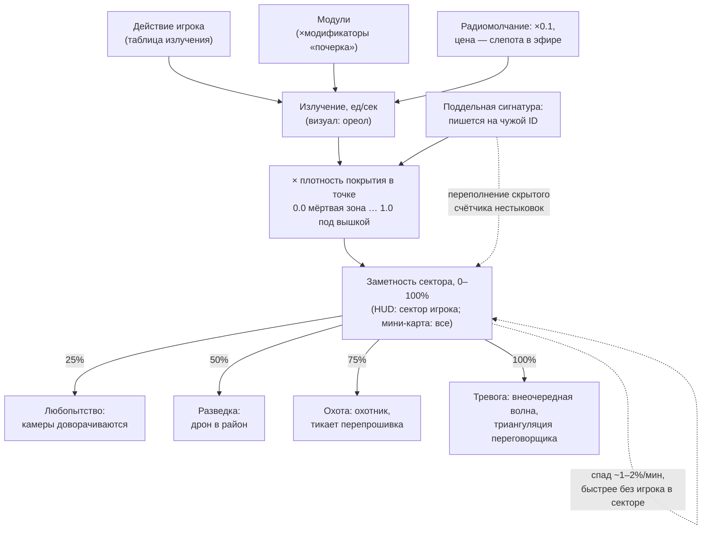

# Математика заметности (принято)

> Решения зафиксированы в обсуждении. Числа — стартовые для прототипа,
> баланс уточняется на срезе.

## Двухслойная модель

### Слой 1 — излучение (мгновенное, ед/сек)

То, что игрок испускает прямо сейчас. Визуал: пульсирующий ореол
(радиус и частота пульса = уровень излучения).

| Действие | Излучение |
|---|---|
| Простой / пауза | 1 |
| Ходьба | 3 |
| Активные сенсоры (расширенный обзор) | +4 |
| Разбор павшей машины | 6 |
| Бег | 8 |
| Зарядка от сети роя | 15 |
| Бой | 25 |

В коде: `Robot.EMISSION: Dictionary[State, float]` — излучение
**суммируется по поднятым битам** маски состояний (IDLE 1, WALK 3;
будущие модификаторы вроде «активные сенсоры +4» — отдельные биты,
складываются сверху).

Модули — модификаторы излучения («почерк» билда):
- армейские сервоприводы: ×1.5 к излучению движения;
- экранированный корпус: ×0.7 ко всему излучению;
- сенсоры с дрона: увеличивают стоимость активных сенсоров и т.п.

### Слой 2 — заметность (накопленная, 0–100%, главная шкала HUD)

- **Прирост** = излучение × плотность покрытия в точке игрока
  (0.0 в мёртвой зоне … 1.0 под вышкой) × `NOTICE_RATE` × игровые минуты.
  **`NOTICE_RATE = 2.5`** %/(ед·мин) — откалибровано прогоном
  (`just balance`, 2026-08-21; стартовое 1.0 оказалось слишком мягким:
  спад съедал всё, кроме ходьбы вплотную к столбу).
- Следствие: в мёртвой зоне сеть не видит ничего — «жить в складках»
  работает буквально.
- **Спад:** `DECAY_PER_MINUTE = 1.5` %/мин в секторе игрока,
  ×2 (`= 3.0`) в остальных. «Отсидеться» — десятки минут:
  100% → 0% за 67 мин рядом / 34 мин после ухода.

## По-секторная модель с гибридной подачей (принято)

- **Сектор = квадрат 8×8 клеток** (`SignalGrid.SECTOR_SIZE`); квартал
  прототипа ≈ 5×5 секторов.
- Сеть хранит заметность **по секторам** («память» сектора об игроке).
- HUD всегда показывает цифру сектора, в котором стоит игрок.
- На мини-карте сектора подкрашиваются красным по уровню их памяти.
- Затухание: память сектора остывает **быстрее, когда игрока в нём нет**.

## Пороги реакций сети

Каждый порог отражается в логе событий — симуляция продаёт себя сама.

| Порог | Реакция |
|---|---|
| **25% — любопытство** | Камеры доворачиваются в район («Камера сменила сектор») |
| **50% — разведка** | В район высылается дрон |
| **75% — охота** | Приходит охотник; вблизи него тикает перепрошивка |
| **100% — тревога** | Внеочередная сканирующая волна по сектору; переговорщик в эфире переходит от уговоров к триангуляции |

## Контрмеры в цифрах

### Радиомолчание
- Излучение ×0.1.
- Цена: игрок слепнет — не видит поля покрытия и агентов вне прямой
  видимости. Размен «данные за тишину».

### Поддельная сигнатура
- Заметность **не снижается — пишется на чужой ID**.
- У подделки **скрытый счётчик нестыковок**:
  - ID замечен в двух местах одновременно;
  - ID числится уничтоженным в реестре роя (только если рой **нашёл
    останки** — спрятанные останки продлевают жизнь ID,
    см. `02-CORE-SYSTEMS.md §7 «Улики»`);
  - поведение не по профилю (бытовой робот ведёт себя как боевой).
- Переполнение счётчика → вся накопленная на ID заметность разом
  падает на игрока.
- Счётчик игроку не виден — азарт вместо таймера.

## Схема системы

## Калибровка прототипа (`just balance`, NOTICE_RATE 2.5)

Чистый прирост в секторе игрока = излучение × покрытие × 2.5 − 1.5.

| Сценарий | Чистый прирост | 25% | 50% | 100% |
|---|---|---|---|---|
| ходьба @ покрытие 1.0 (у столба) | +6.0/мин | 4 мин | 9 мин | 17 мин |
| ходьба @ 0.5 (середина поля) | +2.6/мин | 10 мин | 19 мин | 38 мин |
| ходьба @ 0.25 (край поля) | +0.4/мин | никогда (22% за час) | — | — |
| простой @ 1.0 | +1.0/мин | 24 мин | 49 мин | — |
| зарядка от сети (15) @ 1.0 | +36/мин | 1 мин | 2 мин | 3 мин |
| спад 100% → 0% | −1.5 / −3.0 | 67 мин рядом / 34 мин после ухода | | |

Топология: столб — горячая точка, середина поля опасна при задержке
(пересечение квартала ≈ 8 игровых минут ≈ +20% в покрытии 0.5),
край поля почти безопасен, стоять под вышкой медленно, но не бесплатно,
зарядка от сети — три минуты до полной тревоги. Пересчитывать
`just balance` при любой правке констант.

## Связи с другими системами

- Пороги 75–100% — точка входа перепрошивки (`02-CORE-SYSTEMS.md §4`).
- Плотность покрытия — из SignalGrid, той же структуры, что кормит
  визуальный слой (`06-VISUAL-UI.md §3`).
- Модификаторы модулей — связка с прогрессией (`04-PROGRESSION-ENDINGS.md`).
