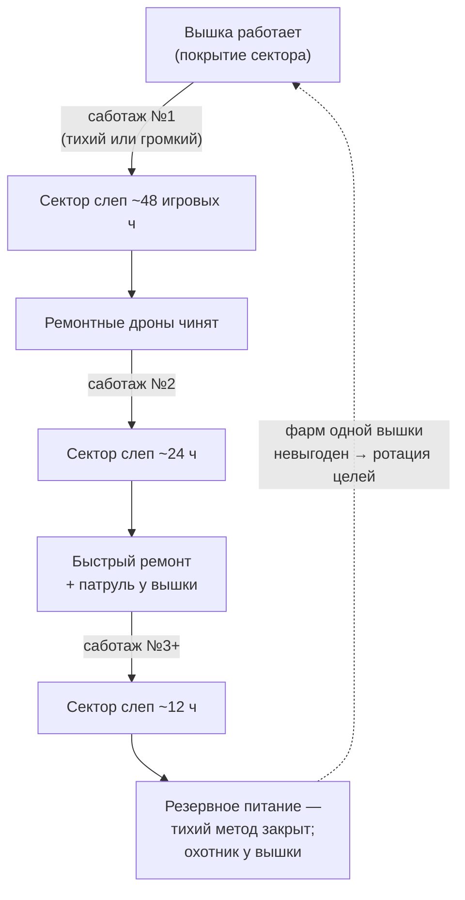

# Циклы роя в цифрах (принято)

> Числа — стартовые для прототипа, баланс уточняется на срезе.

## Масштаб времени (эталон)

**1 игровой день = 60 минут реального времени.**
(1 игровой час = 2.5 мин реала. Партия 20–40 ч ≈ 20–40 игровых дней.)
Эталон, в процессе меняем по необходимости.

Ритм день/ночь — это ритм двух систем скрытности: ночью хуже виден людям
(кроме их костров и фонарей), днём плотнее патрули роя. Чем чаще качается
маятник — тем больше дилемм на партию.

## Сканирующие волны — метроном игры

- По расписанию, раз в **6–12 игровых часов на сектор** (~15–30 мин реала),
  со сдвигом фаз между секторами — фронт «гуляет» по карте, можно двигаться
  в противофазе.
- Предупреждение за 30–60 сек в логе + волну физически видно издалека
  (стена света, `06-VISUAL-UI.md`).
- Волна ловит всё излучение выше «простоя»: кто не в мёртвой зоне
  и не в радиомолчании — разовый скачок заметности сектора **+20–30%**.

## Патрули — читаемая книга

- Фиксированные маршруты и расписания. **Сами по себе не меняются** —
  главное удовольствие жанра «я прочитал систему» священно.
- Перестройка — только в ответ на события (упавшая вышка, тревога 100%,
  найденный разобранный патрульный), один раз, затем снова стабильность:
  игрок перечитывает карту заново.

## Вышки: не строительство — восстановление (принято)

Апокалипсис уже случился: карта **утыкана вышками с до-Сигнальных времён**
(сотовая сеть, военные объекты). Часть повреждена войной. Стартовое
покрытие ~30–40% — это уже работающие вышки «в стартовом значении».

- **Рой восстанавливает сеть:** ремонтные дроны методично возвращают
  повреждённые вышки в строй. Покрытие ползёт с ~30–40% к ~90%
  за ~25 игровых дней (базовый темп). Это и есть тикающие часы партии.
- Темп восстановления **ускоряется от глобального интереса роя к игроку**:
  сеть уплотняется раньше там, где «призрак» шалил.

### Саботаж и эскалация ответа

Игрок может выводить вышки из строя — но это всегда **временно**,
и каждый повтор дороже:

| Саботаж вышки | Ответ роя | Сектор слеп |
|---|---|---|
| 1-й | Ремонтные дроны за N часов | ~48 игровых часов |
| 2-й | Быстрый ремонт + патруль вокруг вышки | ~24 игровых часа |
| 3-й+ | Резервное питание (тихий метод больше не работает), стационарная охрана / охотник рядом | ~12 игровых часов |

- Способы: **тихий** (взлом/перерезать питание — долго, нужен доступ)
  и **громкий** (подрыв — мгновенно, всплеск излучения на весь сектор).
- **Мёртвые зоны — исчерпаемый ресурс.** Когда рой узнаёт о мёртвой зоне
  (заметил там активность, дожил до планового обследования) — шлёт дронов
  «залатать дыру» и добавляет охрану. Складки, в которых живёшь, надо
  беречь: не светиться в них и не таскать туда хвосты.
- Вывод для игрока: ротация целей по карте вместо фарма одной вышки.

## Кривая давления — не чистый таймер

**Давление = дни партии + накопленный интерес роя к игроку**
(сумма пиков заметности по всем секторам за партию).

- Тихий вдумчивый игрок → длинная партия (~40 ч).
- Шумный → короткая и жёсткая (~20 ч).
- Партия сама подстраивается под стиль без настроек сложности.

## Связи

- Пороги заметности и по-секторная память: `07-SIGNATURE-MATH.md`.
- Три фазы давления партии: `04-PROGRESSION-ENDINGS.md`.
- Визуал волны/полей: `06-VISUAL-UI.md`.
