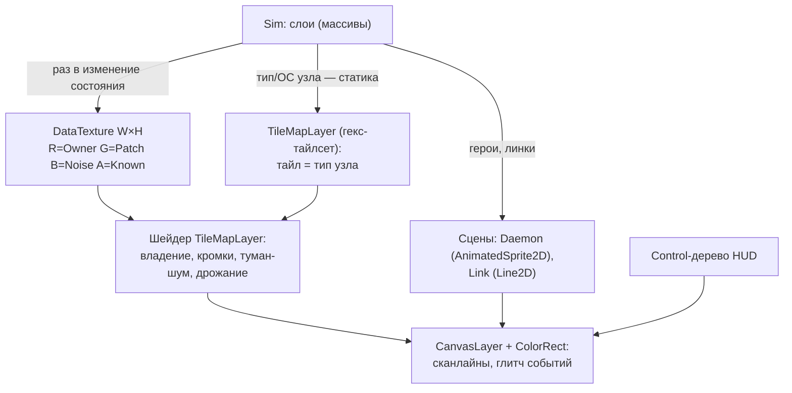

# Визуальный язык, UI, стек рендера

> Концепт-кадры в `concepts/` — векторные мокапы (SVG), сгенерированные
> скриптом: они задают композицию и язык, а не арт-планку.

| | |
|---|---|
|  |  |

## 1. Стиль: «кибер», не «неон»

- **Тёмная сеть.** Фон почти чёрный, узлы — глифы на гексах, владение —
  заливка цветом фракции с низкой яркостью и яркой кромкой.
- **Помехи как язык.** Туман — не серая пелена, а **статический шум**
  (шейдер), сквозь который читается только силуэт гекса. Шумный узел
  «дрожит» (джиттер + хроматическая аберрация). Событие мировой фазы —
  короткий глитч всего экрана.
- **Терминальный HUD.** Моноширинный шрифт, рамки-скобки, значения
  цифрами. Никаких иконок-картинок там, где хватает глифа.
- **Постобработка** — единственный дорогой на вид элемент: сканлайны,
  лёгкая виньетка, кривизна экрана (опционально, отключаемая).
- Арт при этом **дешёвый**: глифы узлов и героев — вектор/пиксель 1–2
  цвета, всё «живое» делают шейдеры и данные.

## 2. Язык цвета

| Что | Цвет |
|---|---|
| Фракции | Цвет — данные фракции, игрок выбирает из палитры на 8: cyan, magenta, amber, lime, violet, orange, ice, red. Соседние по порядку хода различаются и по яркости, не только по тону (дальтонизм) |
| Команда | Союзники — свой цвет каждый, плюс общий значок команды у героев и в HUD; территория союзника — штриховая кромка своим цветом |
| Нейтральный узел | Холодный серо-синий |
| Пустой гекс | Почти фон, без кромки |
| Туман | Статический шум, монохром |
| Шум узла | Красноватое дрожание кромки, интенсивность = `Noise` |
| Укрепление | Двойная/тройная кромка (уровень читается без цифры) |
| Линки | Пунктир цветом владельца ближайшего конца; отключённый — серый разорванный |
| Доступная цель | Подсветка кромки цветом фракции; недоступная — красный крест при наведении с причиной |

Правило: **один цвет = одна фракция**; никакой семантический элемент
не использует цвета фракций.

## 3. Гекс и глифы

- Pointy-top, размер гекса 32 px радиус (ширина ≈ 56, высота 64) при
  зуме 1×; зум 0.5×–2× колесом, целочисленно на 1080p.
- Глиф типа узла — в центре гекса, 1 цвет: `Home` ▭, `Workstation` ▤,
  `Server` ▦ (стопка), `Router` ◈, `IoT` ·, `Controller` ⚙ (плейсхолдеры,
  в игре — свой набор).
- `Patch` — маленькая цифра в углу гекса (только известный), `Hardening` —
  кромки (§2).
- Герой — спрайт-глиф над узлом (`AnimatedSprite2D`, 2–4 кадра «дыхания»),
  цвет фракции, у выбранного — кольцо. ОД — точки под героем.

## 4. Стек рендера (Godot)

- **`TileMapLayer`** с `TileSet` формы Hexagon (pointy-top, odd-r) держит
  статику: тайл = тип узла (глиф). Даёт `MapToLocal`/`LocalToMap`
  бесплатно; конверсия аксиал ↔ offset — на границе (`02-MAP.md §1`).
- **Текстура данных.** Слои симуляции пакуются в `Image` W×H (пиксель =
  гекс) и отдаются шейдеру тайлмапа как uniform. Шейдер сам красит
  владение, кромки укрепления, туман, дрожание шума — **без тайла на
  состояние**. Обновляется только по изменению состояния (после
  `Apply`), не каждый кадр.
- **Герои и линки** — обычные сцены, позиция из `MapToLocal(offset)`.
  Анимация хода — твин между гексами.
- **Постобработка** — `CanvasLayer` поверх всего: сканлайны постоянно,
  глитч — по событию шины (`WorldEventFired`, `DaemonKilled`).
- **Инвариант:** `World` и `TileMapLayer` стоят в (0,0) без трансформа —
  мировые координаты = локальные слоя. Камера двигается, слой — нет.

Почему не `_Draw`: он умеет текстуры и шейдер на весь `CanvasItem`,
но не даёт per-гекс параметров, требует перерисовки на любую анимацию
и не имеет инструментов редактора. Тайлмап + текстура данных закрывает
всё это и остаётся «данные → картинка».

## 5. HUD

| Зона | Содержимое |
|---|---|
| **Верх** | Ход, активная фракция (цвет), Compute (+доход/ход), кнопка/индикатор мировых событий |
| **Право** | Панель выбранного героя: имя, ОД (точки), слоты эксплойтов (ОС, Power, заряды), кнопки действий с ценой; при наведении на цель — проверка захвата («T2 ≥ patch 2 ✓» / «нужен T4») |
| **Право-низ** | Панель узла под курсором: имя, тип, ОС, patch (+укрепление), владелец, шум, «данные хода N» если под туманом |
| **Низ** | Действия фракции: Compile / Spawn / Mutate / **End Turn**; Compile и Spawn активны только при выборе своего сервера |
| **Лево** | Лог событий с номерами ходов: захваты, потери, реплики фракций, мировые события |
| **Лево-верх** | Условия победы: контроль %, роутеры N/M, до turn limit |

Панели генома и создания фракции — модальные экраны. **Экран передачи
хода** (хотсит) — полноэкранный: глушит карту помехами, имя и цвет
следующего игрока, кнопка «Готов». Экран создания партии: список из 2–8
слотов «фракция / контроллер / команда / цвет».

## 6. Читаемость (тест скриншота)

Кадр карты **без HUD** обязан отвечать: чьё что, где фронт, где туман,
где шумно, где укреплено. Проверять на `just shot` начиная с недели 4
(`11-PROTOTYPE-PLAN.md`). Не читается — чинить шейдер, а не добавлять
подписи.

## 7. Анимации и звук

- Захват: кромка гекса «прожигается» цветом за 0.3 с, глиф мигает.
- Смерть героя: спрайт рассыпается в помехи.
- Мировое событие: полноэкранный глитч 0.2 с + строка в логе.
- Звук — вне 8 недель. Задел: события шины уже есть, звук — подписчик.

## 8. Арт-пайплайн

- Глифы и спрайты: SVG (Inkscape/любой редактор) → PNG экспорт,
  либо пиксель в Aseprite — решать на арт-тесте недели 7. Объём
  крошечный: ~7 глифов узлов, 1–3 спрайта героев, иконки HUD.
- Шейдеры — свои, в `project/core/**/*.gdshader`, без аддонов.
- Концепт-кадры (`concepts/*.svg`) генерируются скриптом
  `docs/concepts/gen_frames.py` — правятся числа, не пиксели.
- AI-контент в игровых ассетах не используем.
