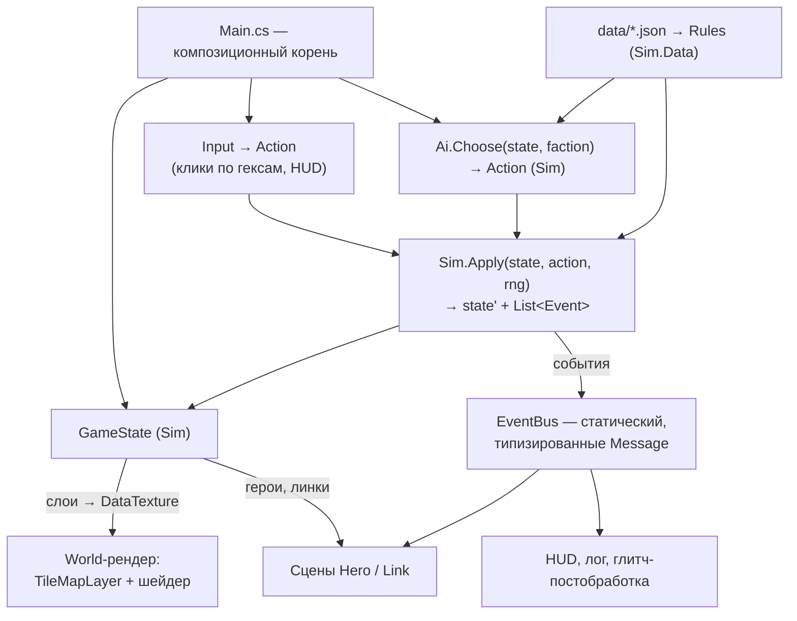

# Архитектура (принято)

> Godot 4.7 mono, C# / net8.0. Структуры данных — в `10-DATA-MODEL.md`.

## Принципы

1. **Ноль внешних зависимостей в Godot.** Никаких аддонов и плагинов —
   весь код свой, шейдеры свои.
2. **Игровой код — C#** (godot-mono 4.7.2, net8.0, Nullable).
   Стиль — официальный Godot через `.editorconfig` + StyleCop,
   `just format` / проверка в `just test`. GDScript — только каркас
   тестового раннера (`tests/test_runner.gd`, `test_case.gd`,
   `style_test.gd`, мост `csharp_test.gd`).
3. **Симуляция не знает про Godot.** `Sim` — отдельная сборка без ссылки
   на `GodotSharp`: карта, фракции, действия, правила, ИИ, генератор.
   Godot-проект её референсит. Это делает headless-прогоны и тесты
   правил дешёвыми и быстрыми.
4. **Состояние + действие → состояние.** Единственный способ изменить
   `GameState` — `Sim.Apply(state, action, rng)`. UI, ИИ, сетевой хотсит
   и реплей — просто разные источники `Action`.
5. **Без autoload.** Композиция через `Main.cs`: корневой скрипт владеет
   состоянием и системами как обычными объектами — явный порядок init,
   явный teardown между партиями.
6. **Данные — в JSON под `project/data/`.** Числа в коде запрещены:
   любой коэффициент правил — из загруженных таблиц.
7. **Детерминизм.** Генерация и мировая фаза — от сида через свой
   `Rng` (xorshift/PCG в `Sim`, не `System.Random` и не `GD.Randi`),
   чтобы партия воспроизводилась бит-в-бит на любой машине.

## Сборки

```
project/
  DevAInt.sln
  DevAInt.csproj            — Godot-проект (рендер, ввод, HUD, сцены)
  sim/DevAInt.Sim.csproj    — чистая симуляция (net8.0, без Godot)
  data/*.json               — таблицы правил
  core/…                    — Godot-код: Main, World (рендер), HUD, Hero-сцена
  tests/                    — раннер + C#-тесты (обе сборки)
  tools/                    — Balance.cs (авто-партии), Shot*.cs
```

`DevAInt.Sim` — обычный `classlib`, `TreatWarningsAsErrors`, тот же
`.editorconfig`. Внутри: `Hex`, `Layer<T>`, `World`, `MapGen`,
`GameState`, `Actions`, `Rules`, `WorldEvents`, `Ai`, `Data` (загрузка
и валидация JSON), `Rng`, `Serialization`.

## Схема систем



## Поток одного действия

1. Ввод (или ИИ) формирует `Action` (`Exploit(heroId, targetHex, slotIx)`).
2. `Sim.Legal(state, action)` — проверка; UI спрашивает её же для подсветки.
3. `Sim.Apply` возвращает новое состояние и список `SimEvent`
   (`NodeCaptured`, `HeroKilled`, `ExploitBurned`, …). Состояние —
   изменяемый объект, копируется только для снапшотов (undo/реплей).
4. `Main` публикует события в `EventBus` → лог, HUD, анимации.
5. `Main` перезаливает текстуру данных и двигает сцены героев.

Godot-слой **не содержит правил**: если что-то решается «в `_Process`» —
это баг архитектуры.

## EventBus — статический, типизированные сообщения

- Сообщение — подкласс `Message` с payload; подписка по типу; подписка
  на базовый тип = слушать всё (лог, отладка).
- `EventBus.Reset()` обязателен при старте партии **и** в teardown
  (`NOTIFICATION_WM_CLOSE_REQUEST`): статическая шина с живыми
  подписками на выгрузке роняет процесс — проверено в v1.
- Границы: шина — для дискретных фактов симуляции и UI. Непрерывного
  в пошаговой игре нет; «каждый кадр» — только анимации, они шину не трогают.

## Композиция и жизненный цикл

- `Main`: `init` в порядке «данные → состояние → рендер → HUD»,
  teardown зеркально, идемпотентно (гард на повторный вызов —
  он приходит и из `WM_CLOSE_REQUEST`, и из `_ExitTree`).
- `init()`/`deinit()` вместо `_Ready`-магии: узлы, получающие зависимости,
  выключают процессинг в `_Ready` и включаются от владельца.
- Node-подписчики шины отписываются явно в `deinit`.
- **Ход ИИ** — не блокирующий: `Main` дёргает `Ai.Choose` по одному
  действию за кадр (или пачкой с анимацией), чтобы ход бота читался
  игроком. Логика та же, что в headless, отличается только темп подачи.

## Сейвы, реплей, отмотка

- Сейв = сериализованный `GameState` (JSON, `System.Text.Json`,
  без Godot-типов) + сид + версия данных.
- Реплей = сид + список `Action`. Детерминизм гарантирует
  воспроизведение; это же — формат бага: «сид + действия».
- Отмотка (после прототипа): снапшоты `GameState` на начало каждого хода.

## Тестовая инфраструктура

- `just test` — как в v1: `dotnet format --verify`, импорт, раннер
  `test_runner.gd` гоняет C#-наборы через мост. Sim-тесты — обычные
  классы, им движок не нужен, но гонять их в том же раннере — ок
  для единообразия.
- **Открытый вопрос:** отдельный `DevAInt.Sim.Tests` на xUnit
  (`dotnet test`, секунды вместо запуска Godot). Решить на неделе 1
  (`12-SCOPE-RISKS.md`). Аргумент за: скорость итераций по правилам;
  против: вторая тестовая инфраструктура.
- Обязательные тесты: round-trip гекс-координат; генератор — связность
  и достижимость от сида; инварианты баланса на данных (`07-BALANCE.md §8`);
  «два бота доигрывают партию»; полнота таблиц данных (все ОС × тиры).
- `tools/Balance.cs` (`just balance`) — N авто-партий, сводка метрик.
- Сцены тестируемы: `MainTest` инстанцирует `main.tscn` и дёргает ввод.

## Производительность

- 432 гекса, 2–10 героев, ход раз в несколько секунд: узких мест нет.
  Текстура данных 24×18 — тривиально. Оптимизации не планируются.
- Авто-партии: 200 партий × 50 ходов × ~50 действий — секунды в Sim
  без Godot. Ради этого и отделена сборка.

## Миграция кода v1 → v2

Код v1 в `project/core/` — под изометрический выживач. План: не
рефакторить, а **сносить по мере замены**, чтобы сборка оставалась
зелёной.

| v1 | Судьба |
|---|---|
| `Main.cs`, `main.tscn` | Остаётся как композиционный корень, переписывается по содержанию |
| `EventBus` + тест | Остаётся как есть |
| `DebugOverlay` | Остаётся, показывает состояние партии |
| `tests/` каркас (`test_runner.gd`, `CsTestBridge`, `CsTestCase`) | Остаётся |
| `GameClock` | Удаляется (пошаговая игра); если понадобится темп анимаций — не он |
| `Iso` | Заменяется `Sim.Hex`; тест round-trip — по образцу `IsoTest` |
| `World` + тайлы | Переписывается под гекс-тайлсет |
| `SignalGrid`, `SignalLayer`, `Halo`, `TowerMarker` | Удаляются; идея «слои → текстура → шейдер» переезжает в World-рендер |
| `Robot`, `Patrol*` | Удаляются |
| `tools/Balance.cs` | Переписывается под авто-партии |
| `tools/ShotDrive.cs` | Переписывается: скрипт действий → кадр |
| `just` рецепты | Остаются, `balance`/`shot-drive` меняют содержимое |

Первый коммит v2 — сборка `Sim` рядом со старым кодом; старое удаляется
на неделе 4, когда рендер v2 встал (`11-PROTOTYPE-PLAN.md`).

## Заметка на потом

- В `project.godot` стоит Forward Plus; для чисто 2D к экспорту взвесить
  Compatibility. Меняется безболезненно в любой момент.
- Хотсит (два человека за одним экраном) — бесплатен архитектурно
  (`Controller: Human` у обеих фракций); онлайн — вне скоупа.
