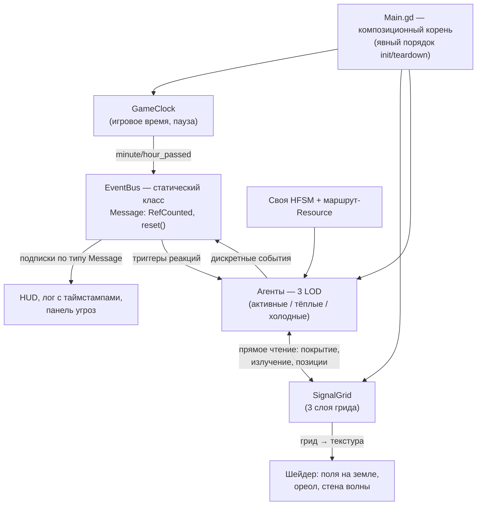

# Архитектура симуляции в Godot (принято)

> Godot 4.x, 2D изометрия. Числа и структуры — стартовые, уточняются на срезе.

## Принципы (приняты)

1. **Ноль внешних зависимостей.** Никаких аддонов и плагинов — весь код свой.
   Поведение агентов — собственная машина состояний, не сторонний BT.
2. **GDScript 100%,** typed. Горячий код — событийный или в шейдерах;
   если что-то упрётся — выносим точечно, но по умолчанию не оптимизируем заранее.
3. **Без autoload.** Классы — статические, либо явно контролируемые синглтоны.
4. **Композиция через `Main.gd`:** корневой скрипт владеет системами
   (`GameClock`, `SignalGrid`, …) как обычными объектами — явный порядок
   инициализации, явный teardown между партиями.
5. Ядро симуляции не привязано к дереву сцены → можно гонять **headless**
   (баланс кривых заметности и циклов роя скриптом, без запуска игры).

## Схема систем

## EventBus — статический класс с типизированными сообщениями

- `EventBus` — статический класс (static vars/funcs), не узел и не autoload.
- Сообщение — подкласс `Message: RefCounted` с типизированным payload
  (`TowerRepaired`, `WaveIncoming`, `SignatureThresholdCrossed`, …).
- Подписка на конкретный тип сообщения; подписка на базовый `Message` =
  слушать всё (лог, отладка).
- Статическое состояние живёт сквозь перезагрузки сцен → **явный
  `EventBus.reset()`** при старте новой партии (часть контракта
  «контролируемый явно»).
- **`EventBus.reset()` обязателен и при выходе из игры** (teardown
  `Main.gd`, `NOTIFICATION_WM_CLOSE_REQUEST`): статическая шина,
  доживающая до teardown движка с живыми подписками, роняет процесс
  heap corruption'ом на выгрузке скриптов — проверено на тестах.
- Из шины бесплатно кормятся: лог с таймстампами, панель угроз,
  триггеры реакций роя, позже — подслушивание людей.
- **Границы применения:** события — для дискретных фактов. Непрерывные
  величины (излучение игрока, позиции агентов) — прямое чтение/вызовы,
  без аллокации Message каждый тик.

## GameClock — время как фундамент

- Обычный класс, принадлежит `Main.gd`.
- Вся симуляция подписана на **игровые** тики (`minute_passed`,
  `hour_passed` через EventBus), не на кадры.
- Эталон: 1 игровой день = 60 мин реала (`08-SWARM-CYCLES.md`).
- Скорости: пауза / 1× / ускорения. На паузе симуляция стоит,
  но **инспекция мира работает** (поля, маршруты, планирование) —
  «вдумчиво, на паузах» закладывается архитектурно.

## SignalGrid — одна структура на симуляцию и рендер

Обычный класс, принадлежит `Main.gd`. Грид с ячейкой ~4×4 тайла, три слоя:

| Слой | Содержимое | Обновление |
|---|---|---|
| Статика | Сумма полей работающих вышек | Только по событию (вышка упала/починена) |
| Динамика | Конусы дронов, фронт волны | Волна в симуляции — «фронт с координатой»; стена света — работа шейдера |
| Память секторов | По-секторная заметность (`07-SIGNATURE-MATH.md`) | По тикам GameClock |

- Грид пакуется в текстуру; **тот же буфер** читает шейдер цветных полей
  на земле. Симуляция и визуал физически не могут разъехаться —
  риск №1 «читаемость невидимого» закрыт архитектурно.

## Три LOD симуляции агентов

| Зона | Кто | Как тикает |
|---|---|---|
| **Активная** (~1.5 экрана от игрока) | Полные сцены: анимация, физика, машина состояний | Каждый кадр |
| **Тёплая** (сектор + соседние) | Запись в массиве, позиция интерполируется по маршруту | 1 Гц |
| **Холодная** (остальная карта) | Агентов нет; только события расписания | По событиям GameClock |

- Переход игрока между секторами = промоция/демоция агентов.
- Маршрут патруля — Resource (точки + тайминги). По нему **одинаково**
  ходит и тёплая запись, и активная сцена: при промоции агент
  «материализуется» там, где его запись была по расписанию.

## Поведение агентов — своя иерархическая машина состояний (HFSM)

- Собственная реализация: `State`, `StateMachine`, вложенные состояния
  (патруль → «идти к точке» / «сканировать» / «реагировать на сигнал»).
- Машина состояний нужна **только активной зоне** (одновременно 5–15 агентов) —
  нагрузки никакой, сложность управляемая.
- Мозг агента = HFSM + расписание (Resource) + чтение SignalGrid.

## Iso — статическая изометрическая математика

- `Iso` — статический класс (`core/iso/iso.gd`): единая точка правды
  о геометрии мира. Константы тайла (128×64, сжатие вертикали 0.5),
  поправка движения `move_direction()`.
- Потребители: робот (движение), далее SignalGrid (клетки покрытия),
  тёплые агенты (маршрут → мир), волна скана, пикинг мышью.
- **Конверсии `world_to_cell`/`cell_to_world` добавлять только вместе
  с тестом-сверкой против `TileMapLayer.map_to_local`/`local_to_map`** —
  иначе симуляция и отрисовка разъедутся на полклетки.

## Паттерны, закреплённые реализацией (неделя 1)

- **`init()`/`deinit()` вместо `_ready`-магии.** Каждый объект,
  получающий зависимости (робот, оверлей), отключает свой процессинг
  в `_ready` и включается только в `init(...)` от владельца; `deinit()`
  симметрично отписывает от шины и отпускает ссылки. Main зовёт их
  в порядке «системы → мир → актёры → UI», teardown — зеркально.
- **Teardown идемпотентен** (гард на повторный вызов): он приходит
  и из `NOTIFICATION_WM_CLOSE_REQUEST`, и из `_exit_tree`.
- **Кламп кадровой дельты в Main:** `advance(minf(delta, MAX_FRAME_DELTA))`.
  Сон ноутбука/фриз ОС = почти-пауза, а не лавина тиков. Кламп живёт
  в Main (политика кадра), НЕ в GameClock (инструмент): тесты и
  headless-балансировка легально впрыскивают часы одним вызовом.
- **Обработчик шины обязан принимать сообщение:**
  `func _on_x(message: Тип) -> void`. Шина зовёт `call(message)`.
- **Node-подписчики шины отписываются явно** в `deinit`/`_exit_tree`,
  не полагаясь на автоочистку мёртвых подписок.
- **Статические данные-таблицы вместо констант-россыпи** (пример:
  `Robot.DRAIN: Dictionary[State, float]`) — расширение без переделки,
  полнота таблицы проверяется тестом.

## Тестовая инфраструктура

- `res://tests/`: раннер `test_runner.gd` (SceneTree, headless,
  `just test`), база `test_case.gd` (`check_*`, `before_each`,
  `wait_frames`), файлы `*_test.gd`.
- Ноль выполненных проверок в тесте = провал (ловит runtime-ошибки).
- `style_test.gd` — автоконтроль GDScript style guide по всем скриптам
  (13 проверок: имена, табы, пустые строки, длина, секции, регистр…).
- Сцены тестируемы: `main_test.gd` инстанцирует `main.tscn` в дерево
  раннера и дёргает `_process`/ввод руками — без ожиданий реального
  времени.

## Производительность — реальные узкие места

- Десятки активных агентов для Godot тривиальны — не риск.
- Статика покрытия — пересчёт только по событиям (см. выше).
- Pathfinding: патрулям путь не нужен (маршруты запечены), поиск — только
  охотникам/дронам в активной зоне → `AStarGrid2D` по тайлам, с запасом.
  NavigationServer не используем.

## Детерминизм и сейвы

- Расписания (патрули, волны, ремонты) детерминированы от сида партии.
- Сейв = гриды SignalGrid + записи агентов + состояние вышек/улик +
  журнал событий.

## Заметка на потом

- В `project.godot` стоит Forward Plus; для чисто 2D к экспорту взвесить
  Compatibility (слабые ПК/ноутбуки — аудитория выживачей).
  Меняется безболезненно в любой момент.
