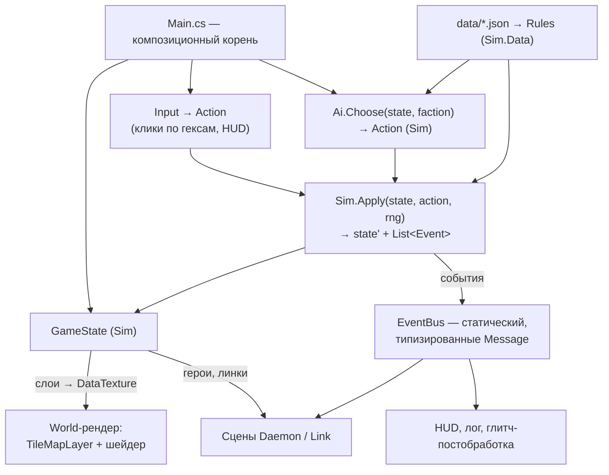

# Архитектура (принято)

> Godot 4.7 mono, C# / net8.0. Структуры данных — в `10-DATA-MODEL.md`.

## Принципы

1. **Ноль внешних зависимостей в Godot.** Никаких аддонов и плагинов —
   весь код свой, шейдеры свои.
2. **Игровой код — C#** (godot-mono 4.7.2, net8.0, Nullable).
   Стиль — официальный Godot через `.editorconfig` + StyleCop,
   `just format` / проверка в `just test`. GDScript — только каркас
   тестового раннера (`tests/test_runner.gd`, `test_case.gd`,
   `style_test.gd`, мост `csharp_test.gd`).
3. **Симуляция не знает про Godot.** `Sim` — отдельная сборка без ссылки
   на `GodotSharp`: карта, фракции, действия, правила, ИИ, генератор.
   Godot-проект её референсит. Это делает headless-прогоны и тесты
   правил дешёвыми и быстрыми.
4. **Состояние + действие → состояние.** Единственный способ изменить
   `GameState` — `Sim.Apply(state, action, rng)`. UI, ИИ, сетевой хотсит
   и реплей — просто разные источники `Action`.
5. **Без autoload.** Композиция через `Main.cs`: корневой скрипт владеет
   состоянием и системами как обычными объектами — явный порядок init,
   явный teardown между партиями.
6. **Данные — в JSON под `project/data/`.** Числа в коде запрещены:
   любой коэффициент правил — из загруженных таблиц.
7. **Детерминизм.** Генерация и мировая фаза — от сида через свой
   `Rng` (xorshift/PCG в `Sim`, не `System.Random` и не `GD.Randi`),
   чтобы партия воспроизводилась бит-в-бит на любой машине. В правилах —
   только целые и простые операции с float (`+ − × ÷`, сравнения);
   никаких `Math.Pow/Sin/Exp` и порядок-зависимых сумм по словарям:
   это условие сетевого lockstep.
8. **N-ready.** Фракции — список (2–8), команды — поле `Team`, порядок
   хода — список, туман — слой на фракцию. `Factions[0]`/`[1]` в коде —
   баг.

## Сборки

```
.editorconfig               — общий стиль C# для обеих сборок
sim/
  DevAInt.Sim/              — чистая симуляция (net8.0 classlib, без Godot)
  DevAInt.Sim.Tests/        — xUnit-тесты симуляции (`dotnet test`)
project/
  DevAInt.sln               — включает Godot-проект и обе сборки sim/
  DevAInt.csproj            — Godot-проект (рендер, ввод, HUD, сцены), ProjectReference на Sim
  data/*.json               — таблицы правил
  core/…                    — Godot-код: Main, World (рендер), HUD, Daemon-сцена
  tests/                    — Godot-раннер + тесты сцен
  tools/                    — Balance.cs (авто-партии), Shot*.cs
```

`sim/` лежит **вне** `project/`: Godot-csproj по умолчанию компилирует все
`**/*.cs` под собой, и вложенная сборка потребовала бы исключений.
`DevAInt.Sim` — обычный `classlib` с тем же `.editorconfig` и StyleCop.
Внутри: `Hex`, `Layer<T>`, `World`, `MapGen`, `GameState`, `Actions`,
`Rules`, `WorldEvents`, `Ai`, `Data` (загрузка и валидация JSON), `Rng`,
`Serialization`.

## Схема систем



## Поток одного действия

1. Ввод (или ИИ) формирует `Action` (`Exploit(daemonId, targetHex, slotIx)`).
2. `Sim.Legal(state, action)` — проверка; UI спрашивает её же для подсветки.
3. `Sim.Apply` возвращает новое состояние и список `SimEvent`
   (`NodeCaptured`, `DaemonKilled`, `ExploitBurned`, …). Состояние —
   изменяемый объект, копируется только для снапшотов (undo/реплей).
4. `Main` публикует события в `EventBus` → лог, HUD, анимации.
5. `Main` перезаливает текстуру данных и двигает сцены героев.

Godot-слой **не содержит правил**: если что-то решается «в `_Process`» —
это баг архитектуры.

## EventBus — статический, типизированные сообщения

- Сообщение — подкласс `Message` с payload; подписка по типу; подписка
  на базовый тип = слушать всё (лог, отладка).
- `EventBus.Reset()` обязателен при старте партии **и** в teardown
  (`NOTIFICATION_WM_CLOSE_REQUEST`): статическая шина с живыми
  подписками на выгрузке роняет процесс — проверено в v1.
- Границы: шина — для дискретных фактов симуляции и UI. Непрерывного
  в пошаговой игре нет; «каждый кадр» — только анимации, они шину не трогают.

## Композиция и жизненный цикл

- `Main`: `init` в порядке «данные → состояние → рендер → HUD»,
  teardown зеркально, идемпотентно (гард на повторный вызов —
  он приходит и из `WM_CLOSE_REQUEST`, и из `_ExitTree`).
- `init()`/`deinit()` вместо `_Ready`-магии: узлы, получающие зависимости,
  выключают процессинг в `_Ready` и включаются от владельца.
- Node-подписчики шины отписываются явно в `deinit`.
- **Ход ИИ** — не блокирующий: `Main` дёргает `Ai.Choose` по одному
  действию за кадр (или пачкой с анимацией), чтобы ход бота читался
  игроком. Логика та же, что в headless, отличается только темп подачи.

## Сейвы, реплей, отмотка

- Сейв = сериализованный `GameState` (JSON, `System.Text.Json`,
  без Godot-типов) + сид + версия данных.
- Реплей = сид + список `Action`. Детерминизм гарантирует
  воспроизведение; это же — формат бага: «сид + действия».
- Отмотка (после прототипа): снапшоты `GameState` на начало каждого хода.

## Тестовая инфраструктура

- `just test` — как в v1: `dotnet format --verify`, импорт, раннер
  `test_runner.gd` гоняет C#-наборы через мост. Sim-тесты — обычные
  классы, им движок не нужен, но гонять их в том же раннере — ок
  для единообразия.
- **`Sim` тестируется xUnit** (`sim/DevAInt.Sim.Tests`, `dotnet test`,
  секунды без запуска движка; `just test-sim` — быстрый цикл,
  `just test` гоняет оба набора). Решено 2026-09-08.
- Обязательные тесты: round-trip гекс-координат; генератор — связность
  и достижимость от сида; инварианты баланса на данных (`07-BALANCE.md §8`);
  «два бота доигрывают партию»; полнота таблиц данных (все ОС × тиры).
- `tools/Balance.cs` (`just balance`) — N авто-партий, сводка метрик.
- Сцены тестируемы: `MainTest` инстанцирует `main.tscn` и дёргает ввод.

## Производительность

- 520 гексов, 2–10 героев, ход раз в несколько секунд: узких мест нет.
  Текстура данных 26×20 — тривиально. Оптимизации не планируются.
- Авто-партии: 200 партий × 50 ходов × ~50 действий — секунды в Sim
  без Godot. Ради этого и отделена сборка.

## Миграция кода v1 → v2

**Снос выполнен 2026-09-08** (сразу, а не на неделе 4: старый код не
нужен даже как образец — принципы зафиксированы здесь). Что осталось
в `project/`:

| Осталось | Роль |
|---|---|
| `core/main/Main.cs`, `main.tscn` | Композиционный корень: init оверлея, teardown с `EventBus.Reset()`, идемпотентен |
| `core/event_bus/EventBus.cs` | Шина, без изменений |
| `core/debug_overlay/` | Экранный лог всех сообщений шины (кольцевой буфер) |
| `tests/` | Раннер, база, мост C#, `style_test.gd`, тесты `EventBus`/`Main`/`DebugOverlay` |
| `just` рецепты | `build`, `run`, `editor`, `test`, `format`, `shot`; `balance` вернётся на неделе 3 под авто-партии |

Удалены целиком: `GameClock`, `Iso`, `World` с тайлами, `SignalGrid`,
`SignalLayer`, `Halo`, `TowerMarker`, `Robot`, `Patrol*`, `tools/`
(`Balance`, `ShotDrive`), их тесты, input-действия v1 в `project.godot`.
Идея «слои → текстура → шейдер» из `SignalLayer` переезжает в World-рендер
v2 (`08-VISUAL-UI.md §4`). Старый код — в истории git до 2026-09-08.

## Мультиплеер

Один принцип на все режимы: **партия = сид + настройки + поток
действий**. `Sim` детерминирован, значит любой, кто видел те же действия,
имеет то же состояние.

| Режим | Как | Когда |
|---|---|---|
| Против бота | `Main` дёргает `Ai.Choose` для `Ai`-фракций | Прототип |
| **Хотсит** | Несколько `Human`-фракций; `Main` между ходами показывает экран передачи хода и переключает «активную точку зрения» (какой `KnownBy` рисовать) | Прототип, неделя 6 |
| Онлайн, lockstep | Хост — авторитет порядка: клиенты шлют `Action`, хост валидирует `Legal`, рассылает всем, каждый применяет локально. Боты считаются на хосте. Реплей и сейв — тот же поток | После прототипа |
| Онлайн, серверный | Если lockstep даст читерство по туману (у каждого клиента полное состояние в памяти): сервер держит состояние и шлёт каждому только его `KnownBy`-срез. Требует «частичного `GameState`» — не закладываем, но не блокируем | По потребности |

Что это требует уже сейчас (и что дёшево):
- `Action` и `GameState` сериализуемы в JSON без Godot-типов (уже принцип).
- `Controller` — тип с вариантом `Remote`; `Main` различает «ждать ввода
  здесь», «спросить бота», «ждать из сети».
- Точка зрения рендера — параметр (`viewFaction`), а не «фракция 0».
- Никакого состояния партии в узлах Godot: всё в `GameState`.

Транспорт (Godot `ENetMultiplayerPeer`/`WebSocket`) и лобби — отдельная
работа после прототипа, в `Sim` она не заходит.

## Заметка на потом

- В `project.godot` стоит Forward Plus; для чисто 2D к экспорту взвесить
  Compatibility. Меняется безболезненно в любой момент.
