# Первые 8 недель прототипа (принято)

**Цель окна:** доказать или похоронить два главных риска минимальным кодом —
«читаемость невидимого» и «жить в складках — это интересно».
Это самая злая выжимка вертикального среза, не его начало «вообще».

## Статус выполнения

- **Неделя 1 — ✅ завершена 2026-08-21.** Скелет готов целиком:
  `EventBus` (типизированные сообщения, приоритеты, наследование типов,
  отложенная отправка), `GameClock` (тики минута/час/день со снимком
  времени, скорости, тумблер паузы, прогресс дня), `Main` (композиция,
  кламп дельты, идемпотентный teardown), `DebugOverlay` (состояние + лог
  шины), greybox-квартал (изометрия 128×64, коллизия стен, Y-сортировка),
  `Robot` (движение с изометрической поправкой, заморозка на паузе,
  батарея по состояниям). 59 автотестов + автоконтроль стиля,
  `just test` зеленый.
- Отклонение от плана в плюс: батарея сделана **таблицей расхода
  по состояниям** (`State`/`DRAIN`, взвешенное среднее по долям минуты)
  вместо пары констант idle+move — масштабируется на будущие состояния
  (зарядка, сканирование, бег) без переделки.
- **Неделя 2 — ✅ завершена 2026-08-21.** `Iso` с конверсиями мир↔клетка
  (сверены бит-в-бит с `TileMapLayer`), `SignalGrid` (статика от вышек,
  картинка под текстуру, `OnStaticChanged`), `SignalLayer` (шейдер полей
  на земле по той же формуле клетки), `Halo` (ореол излучения, плавный),
  три вышки-заглушки. **Чекпоинт читаемости пройден** по скриншоту
  (`just shot`): покрытие/дыры/градиент/привязка к земле читаются без
  подписей. Заметка: `TOWER_RADIUS = 600` накрывает почти весь квартал —
  для «складок» ужать до ~350–400 или раздвинуть вышки.
- **Неделя 3 — ✅ завершена 2026-08-21.** Память секторов (прирост
  излучение × покрытие прямым вызовом, спад по тикам, секторы 8×8), битовая
  маска состояний робота с таблицей `EMISSION`, `just balance` и калибровка
  `NOTICE_RATE = 2.5` (таблица в `07`), уровни тревоги сектора
  (`SignalGrid.Level`: NONE/CURIOUS/SCOUT/HUNT/ALARM по порогам 25/50/75/100
  с гистерезисом 5, сообщение `OnNoticeLevelChanged`), первая шкала HUD
  «NOTICE %» с цветом уровня и экранный лог событий с игровыми таймстампами
  (буфер 8 строк, фильтр шума). 108 тестов. Снимок `just shot-drive`:
  робот у вышки на x16 — `NOTICE 83% HUNT`, в логе хроника
  CURIOUS → SCOUT → HUNT по минутам.
- Недели 4–8 — впереди; следующий — **неделя 4, патрульный** (маршрут-Resource,
  LOD тёплый/активный, своя HFSM) и гейт №1 «возникает ли планирование».
- Инструменты: `just shot` (пассивный кадр), `just shot-drive`
  (`tools/shot_drive.gd` ведёт робота и время input-действиями — кадры
  с заполненной шкалой), `just balance` (кривые заметности).

## Что режем без жалости (в 8 недель НЕ входит)

Люди целиком, перепрошивка, модули как система (кроме проверки
«бумажной куклы» в арт-тесте), коррозия и температура, бой, финалы,
сейвы, звук, меню, онбординг. Всё это живёт в доках и ждёт своей фазы.

## Карта недель и гейтов

```mermaid
flowchart LR
    W1["Нед. 1<br/>Скелет:<br/>Main, Clock,<br/>EventBus, greybox"]
    W2["Нед. 2<br/>Сигнальный слой:<br/>SignalGrid + шейдер"]
    G0{"Чекпоинт<br/>читаемости"}
    W3["Нед. 3<br/>Заметность:<br/>пороги, HUD, лог,<br/>headless-баланс"]
    W4["Нед. 4<br/>Патрульный:<br/>LOD + HFSM"]
    G1{"Гейт №1:<br/>возникает<br/>планирование?"}
    W5["Нед. 5<br/>Волна, мёртвые зоны,<br/>радиомолчание, дрон"]
    W6["Нед. 6<br/>Саботаж вышки,<br/>ремонт, разбор машин"]
    W7["Нед. 7<br/>Арт-тест в пикселе,<br/>бумажная кукла"]
    W8["Нед. 8<br/>«Мёртвый» режим,<br/>плейтест 60–90 мин"]
    G2{"Гейт №2:<br/>3 критерия"}
    VS["Вертикальный срез<br/>мес. 2–3"]
    FIX["Чинить, не наращивая<br/>контент сверху"]

    W1 --> W2 --> G0
    G0 -- "читается" --> W3
    G0 -- "нет — чиним" --> W2
    W3 --> W4 --> G1
    G1 -- "да" --> W5
    G1 -- "нет — стоп и разбор" --> W4
    W5 --> W6 --> W7 --> W8 --> G2
    G2 -- "3×да" --> VS
    G2 -- "есть «нет»" --> FIX
```

## Понедельная раскладка

### Неделя 1 — скелет
- `Main.gd` как композиционный корень; `GameClock` (день = 60 мин,
  пауза/скорости); `EventBus` (статический, типизированные Message, reset).
- Greybox: один квартал из серых ромбов 128×64, робот-капсула, движение,
  расход заряда от перемещения.
- Ничего не светится, ничего не угрожает — но время уже тикает через шину.

### Неделя 2 — сигнальный слой (риск №1 — поэтому первый)
- `SignalGrid`: статический слой покрытия от 3–4 вышек-заглушек,
  грид → текстура → шейдер цветных полей на земле + пульсирующий ореол игрока.
- **Чекпоинт читаемости:** скриншот greybox без единой подписи — видно ли,
  где покрытие, где дыра, насколько я «громкий»?
- Не читается — неделя 3 тоже уходит сюда. Правило: не читается — не идём дальше.

### Неделя 3 — заметность в цифрах
- Таблица излучения из `07-SIGNATURE-MATH.md`, по-секторная память, спад,
  пороги 25/50 (пока без охоты), шкала HUD, лог событий с таймстампами.
- **Headless-прогон:** скрипт гоняет симуляцию без рендера, строит кривые
  накопления/спада — числа балансируются до того, как «ощущаются».

### Неделя 4 — первый житель мира
- Патрульный: маршрут-Resource, тёплая запись ↔ активная сцена
  (промоция на границе зоны), своя HFSM (идти → сканировать → реагировать).
- **Гейт №1:** заряд + заметность + один патруль — возникает планирование?
  Тест: ловлю ли себя на «пережду его цикл в дыре, потом пойду»?
  Нет — стоп и разбор: дальше строить не на чем.

### Неделя 5 — метроном и контрмеры
- Сканирующая волна: фронт в симуляции + стена света в шейдере,
  предупреждение в лог. Мёртвые зоны как читаемые дыры.
- Радиомолчание (×0.1, слепнешь). Порог 50% → прилетает дрон-разведчик.
- Впервые живёт цикл «прочитал расписание → спланировал → успел до волны».

### Неделя 6 — вышка отвечает
- Громкий саботаж → сектор слепнет → ремонтные дроны по таймерам
  из `08-SWARM-CYCLES.md` → эскалация ур. 1 (патруль у вышки).
- Разбор павших машин: запчасти и заряд как награда за риск.
- Петля замкнулась: есть зачем выходить из складки и есть цена.

### Неделя 7 — арт-тест поверх живого greybox
- Одна улица, робот (ходьба, 4 направления), вышка — в целевом пикселе
  (`06-VISUAL-UI.md §6`); «бумажная кукла»: один модуль-слой поверх корпуса.
- Параллельно — доводка мелочей прошлых недель.
- Критерий: кадр без HUD «выглядит как скриншот из Steam».

### Неделя 8 — партия на час
- Отключение («притвориться мёртвым») как последний глагол. Полировка.
- **Плейтест 60–90 минут** (сам + 1–2 человека со стороны).

## Гейт №2 — финальный, три критерия

1. **Читаемость:** незнакомый человек за 10 минут без объяснений понимает,
   где опасно.
2. **Системность:** плейтестер вслух описывает план, а не рефлексы
   («пережду волну в дыре, потом к вышке») — дрейфа в экшен нет.
3. **Напряжение:** час без контента, людей и сюжета — держит.

Три «да» → полный вертикальный срез (мес. 2–3: охотник, поддельная
сигнатура, улики, перепрошивка). Есть «нет» → чиним именно его,
не наращивая контент сверху.

## Принципы порядка

- Самое рискованное — вперёд: сигнальный слой на неделе 2, а не HUD и не арт.
- Каждая неделя опирается на проверенное предыдущей.
- В любой момент окна на руках работающая, показываемая сборка.
