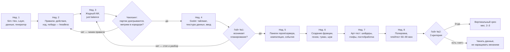

# Первые 8 недель прототипа (принято)

**Цель окна:** доказать или похоронить главный риск минимальным кодом —
**«дуэль против бота рождает планы и держит напряжение»**. Это выжимка
вертикального среза, не «начало вообще».

## Статус выполнения

- **2026-09-07 — концепт v2 принят, библия переписана.**
- **2026-09-08 — код v1 снесён** (`09-ARCHITECTURE.md §Миграция`).
  Осталось: `Main`, `EventBus`, `DebugOverlay`, тестовый каркас;
  `just test` зелёный (15 тестов).
- Неделя 1 — впереди: сборка `Sim`, `Hex`, `Layer<T>`, генератор.

## Что режем без жалости (в 8 недель НЕ входит)

Сценарии, третья+ фракция, хотсит, сейвы/отмотка, звук, меню и онбординг,
дерево генома глубже двух ступеней, реплики фракций (кроме заглушек в логе),
заглядывание ИИ, экран статистики, локализация.

## Карта недель и гейтов

## Понедельная раскладка

### Неделя 1 — ядро данных
- Сборки `sim/DevAInt.Sim` и `sim/DevAInt.Sim.Tests` (xUnit), ссылка
  из `DevAInt.csproj`, `just build`/`just test` зелёные с обеими.
- `Hex` (аксиал, соседи, дистанция, offset round-trip), `Layer<T>`.
- `Rules.Load` + все `*.json` с числами из `07-BALANCE.md`; валидация
  данных как тест.
- `MapGen` от сида: кластеры, роутеры-коридоры, линки, старты, имена;
  тест связности/достижимости; ASCII-дамп карты в консоль для глаз.

### Неделя 2 — правила без картинки
- `GameState`, `Sim.NewGame`, все `Action`, `Legal`/`Check`/`Apply`,
  `CanCapture` с разбором.
- Upkeep, мировая фаза (Burnout, Patch wave, Audit), победа/поражение.
- Тест «сид 42 + скрипт из 30 действий → ожидаемое состояние» (золотой
  снапшот). Тест каждого правила по отдельности на крошечной карте 5×5.

### Неделя 3 — противник и метроном
- `Ai.Choose`: оценка действий героя, политика покупок, спец. правила.
- `tools/Balance.cs` (`just balance`): 200 партий бот-против-бота,
  таблица метрик из `07-BALANCE.md §9`.
- **Чекпоинт:** партии доигрываются без исключений; длина 35–55;
  turn limit < 30 %. Не в коридоре — крутим данные и правила, не идём
  к рендеру. Здесь дешевле всего.

### Неделя 4 — впервые видно
- `TileMapLayer` с гекс-тайлсетом (плейсхолдер-глифы), текстура данных
  → шейдер: владение, туман, кромки. Герои-спрайты, линки-линии.
- Клик по гексу → `Action`, подсветка легальных целей, End Turn,
  ход бота с подачей по действию за кадр. Минимальный HUD: ход, Compute,
  ОД героя, слоты.
- `just shot` — кадр партии.
- **Гейт №1:** сыграть 3 партии против бота. Ловлю ли себя на плане
  («сначала роутер, потом сервер, T3 придержать»)? Нет — стоп и разбор:
  дальше строить не на чем.

### Неделя 5 — полный ход
- Панель героя (слоты, заряды, проверка захвата при наведении), панель
  узла, панель сервера (Compile/Spawn), лог событий с номерами ходов.
- Мировые события с текстом и глитчем.

### Неделя 6 — фракция и информация
- Экран создания фракции: имя, цвет, мутаторы на бюджет; пресеты.
- Экран генома (покупки, `Requires`).
- Туман «память»: устаревшие данные, «данные хода N»; шум как видимость
  и аудит — визуально.

### Неделя 7 — арт-тест
- Свои глифы узлов и спрайты героев, шейдер помех тумана, дрожание шума,
  постобработка (сканлайны, глитч). Проверка языка цвета.
- Критерий: кадр без HUD объясняет ситуацию и «выглядит как скриншот».

### Неделя 8 — партия на час
- Полировка темпа, подсказки в UI, экран итога.
- **Плейтест 60–90 минут** (сам + 1–2 человека со стороны).

## Гейт №2 — три критерия

1. **Читаемость:** незнакомый человек за 10 минут без объяснений понимает,
   чьё что, где опасно и что делать с героем.
2. **Планирование:** плейтестер вслух описывает план хода, а не кликает
   подсвеченное.
3. **Напряжение и темп:** партия против бота заканчивается за 30–60 минут,
   и в ней есть момент «ой» (потеря героя, аудит, сожжённый зеро-дей).

Три «да» → вертикальный срез (мес. 2–3: сценарии, дерево генома,
третья фракция, ИИ с заглядыванием, звук). Есть «нет» → чиним данные
и правила именно там, не наращивая механики сверху.

## Принципы порядка

- Правила и бот — раньше картинки: чинить симуляцию без рендера дёшево.
- Каждая неделя опирается на проверенное предыдущей.
- С недели 4 в любой момент на руках играбельная сборка.
